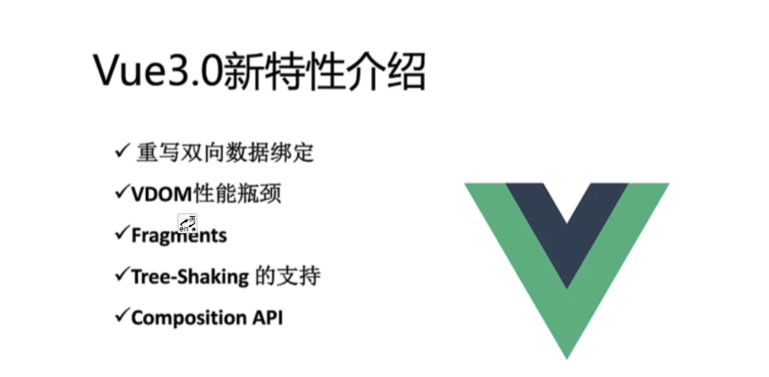
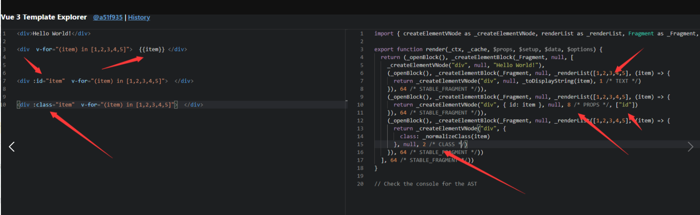

[//]: # (### [视频教程]&#40;https://www.bilibili.com/video/BV1dS4y1y7vd/?spm_id_from=333.999.0.0&vd_source=7313597670b28c3c44c50e326d82d040&#41;)

### 1.介绍vue

Vue (读音 /vjuː/，类似于 view) 是一套用于构建用户界面的渐进式框架。与其它大型框架不同的是，Vue 被设计为可以自底向上逐层应用。Vue
的核心库只关注视图层，不仅易于上手，还便于与第三方库或既有项目整合。另一方面，当与现代化的工具链以及各种支持类库结合使用时，Vue
也完全能够为复杂的单页应用提供驱动。

MVVM（Model-View-ViewModel）架构

1. 『View』：视图层（UI 用户界面）
2. 『ViewModel』：业务逻辑层（一切 js 可视为业务逻辑）
3. 『Model』：数据层（存储数据及对数据的处理如增删改查）


官方文档地址   [介绍 — Vue.js](https://cn.vuejs.org/v2/guide/#Vue-js-%E6%98%AF%E4%BB%80%E4%B9%88)

[新版地址文档快速开始 | Vue.js](https://staging-cn.vuejs.org/guide/quick-start.html)

### 2.Vue3 新特性介绍



- 重写双向绑定

```text
vue2
基于Object.defineProperty()实现
 
vue3 基于Proxy
proxy与Object.defineProperty(obj, prop, desc)方式相比有以下优势：
 
//丢掉麻烦的备份数据
//省去for in 循环
//可以监听数组变化
//代码更简化
//可以监听动态新增的属性；
//可以监听删除的属性 ；
//可以监听数组的索引和 length 属性；
 
    let proxyObj = new Proxy(obj,{
        get : function (target,prop) {
            return prop in target ? target[prop] : 0
        },
        set : function (target,prop,value) {
            target[prop] = 888;
        }
    })
```


- Vue3 优化Vdom

在Vue2中,每次更新diff,都是全量对比,Vue3则只对比带有标记的,这样大大减少了非动态内容的对比消耗

[Vue Template Explorer](https://vue-next-template-explorer.netlify.app/) 我们可以通过这个网站看到静态标记



- patch flag 优化静态树

```html

<span>Hello world!</span>
<span>Hello world!</span>
<span>Hello world!</span>
<span>Hello world!</span>
<span>{{msg}}</span>
<span>Hello world!</span>
<span>Hello world! </span>
```

Vue3 编译后的 Vdom 是这个样子的

```text
TEXT = 1 // 动态文本节点
CLASS=1<<1,1 // 2//动态class
STYLE=1<<2，// 4 //动态style
PROPS=1<<3,// 8 //动态属性，但不包含类名和样式
FULLPR0PS=1<<4,// 16 //具有动态key属性，当key改变时，需要进行完整的diff比较。
HYDRATE_ EVENTS = 1 << 5，// 32 //带有监听事件的节点
STABLE FRAGMENT = 1 << 6, // 64 //一个不会改变子节点顺序的fragment
KEYED_ FRAGMENT = 1 << 7, // 128 //带有key属性的fragment 或部分子字节有key
UNKEYED FRAGMENT = 1<< 8, // 256 //子节点没有key 的fragment
NEED PATCH = 1 << 9, // 512 //一个节点只会进行非props比较
DYNAMIC_SLOTS = 1 << 10 // 1024 // 动态slot
HOISTED = -1 // 静态节点
BALL = -2
```
我们发现创建动态 dom 元素的时候，Vdom 除了模拟出来了它的基本信息之外，还给它加了一个标记： 1 /* TEXT */

这个标记就叫做 patch flag（补丁标记）

patch flag 的强大之处在于，当你的 diff 算法走到 _createBlock 函数的时候，会忽略所有的静态节点，只对有标记的动态节点进行对比，而且在多层的嵌套下依然有效。

尽管 JavaScript 做 Vdom 的对比已经非常的快，但是 patch flag 的出现还是让 Vue3 的 Vdom 的性能得到了很大的提升，尤其是在针对大组件的时候。

- Vue3 Fragment

vue3 允许我们支持多个根节点

```html
 
<template>
  <div>12</div>
  <div>23</div>
</template>
```
同时支持render JSX 写法

```text
render() {
        return (
            <>
                {this.visable ? (
                    <div>{this.obj.name}</div>
                ) : (
                    <div>{this.obj.price}</div>
                )}
                <input v-model={this.val}></input>
                {[1, 2, 3].map((v) => {
                   return <div>{v}-----</div>;
                })}
            </>
        );
    },
 
```
同时新增了Suspense teleport  和  多 v-model 用法
