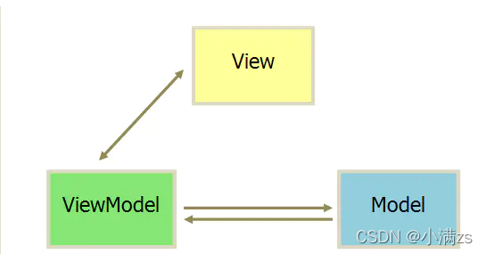

## 学习Vue3 第一章

### [视频教程](https://www.bilibili.com/video/BV1dS4y1y7vd/?spm_id_from=333.999.0.0&vd_source=7313597670b28c3c44c50e326d82d040)

### 1.介绍vue

Vue (读音 /vjuː/，类似于 view) 是一套用于构建用户界面的渐进式框架。与其它大型框架不同的是，Vue 被设计为可以自底向上逐层应用。Vue 的核心库只关注视图层，不仅易于上手，还便于与第三方库或既有项目整合。另一方面，当与现代化的工具链以及各种支持类库结合使用时，Vue 也完全能够为复杂的单页应用提供驱动。

MVVM（Model-View-ViewModel）架构

1. 『View』：视图层（UI 用户界面）
2. 『ViewModel』：业务逻辑层（一切 js 可视为业务逻辑）
3. 『Model』：数据层（存储数据及对数据的处理如增删改查）

