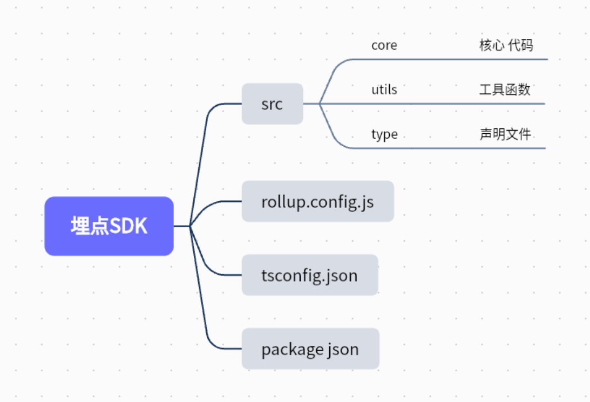
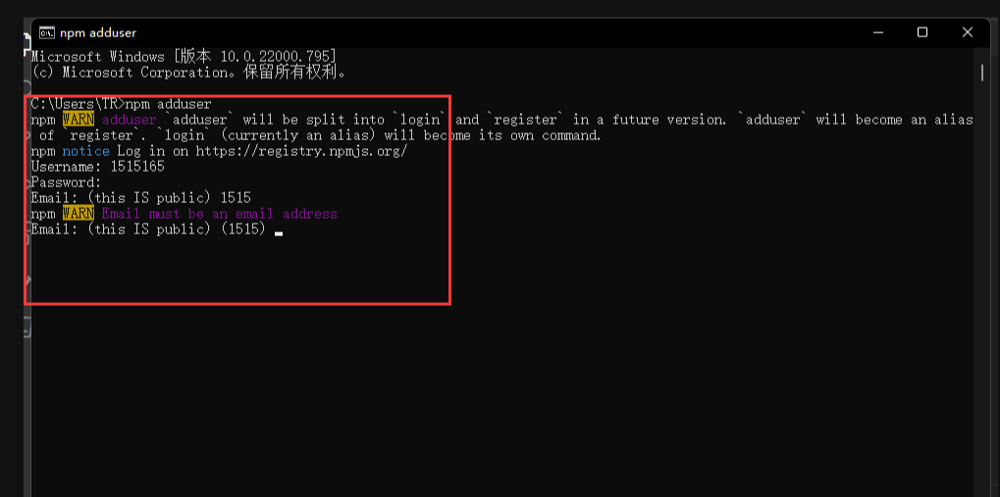
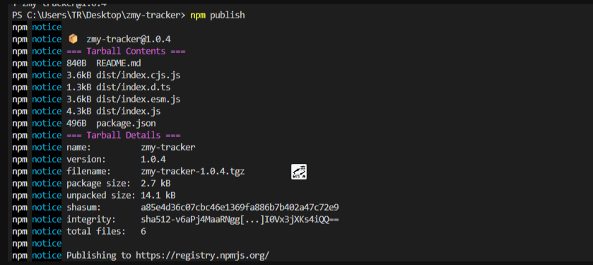

埋点就是 数据采集-数据处理-数据分析和挖掘，如用户停留时间，用户哪个按钮点的多，等

技术架构使用ts + rollup

使用ts主要是在编译过程中发现问题，减少生产代码的错误，

使用rollup 应为 rollup打包干净，而webpack非常臃肿，可读性差，所以rollup非常适合开发SDK和一些框架，webpack 适合开发一些项目

### 1.目录结构设计



### 2.安装开发依赖

```shell
npm install rollup -D
npm install rollup-plugin-dts -D
npm install rollup-plugin-typescript2 -D
npm install typescript -D
```

### 3.配置rollup config js

```typescript
import ts from 'rollup-plugin-typescript2'
import path from 'path'
import dts from 'rollup-plugin-dts';

export default [{
    //入口文件
    input: "./src/core/index.ts",
    output: [
        //打包esModule
        {
            file: path.resolve(__dirname, './dist/index.esm.js'),
            format: "es"
        },
        //打包common js
        {
            file: path.resolve(__dirname, './dist/index.cjs.js'),
            format: "cjs"
        },
        //打包 AMD CMD UMD
        {
            input: "./src/core/index.ts",
            file: path.resolve(__dirname, './dist/index.js'),
            format: "umd",
            name: "tracker"
        }

    ],
    //配置ts
    plugins: [
        ts(),
    ]

}, {
    //打包声明文件
    input: "./src/core/index.ts",
    output: {
        file: path.resolve(__dirname, './dist/index.d.ts'),
        format: "es",
    },
    plugins: [dts()]
}] 
```

### 4. src type 定义类型

```typescript
/**
 * @requestUrl 接口地址
 * @historyTracker history上报
 * @hashTracker hash上报
 * @domTracker 携带Tracker-key 点击事件上报
 * @sdkVersionsdk版本
 * @extra透传字段
 * @jsError js 和 promise 报错异常上报
 */
export interface DefaultOptons {
    uuid: string | undefined,
    requestUrl: string | undefined,
    historyTracker: boolean,
    hashTracker: boolean,
    domTracker: boolean,
    sdkVersion: string | number,
    extra: Record<string, any> | undefined,
    jsError: boolean
}

//必传参数 requestUrl
export interface Options extends Partial<DefaultOptons> {
    requestUrl: string,
}

//版本
export enum TrackerConfig {
    version = '1.0.0'
}

//上报必传参数
export type reportTrackerData = {
    [key: string]: any,
    event: string,
    targetKey: string
}
```

### 5.src core 核心功能

<font color="red">
PV：页面访问量，即PageView，用户每次对网站的访问均被记录
</font>

主要监听了 history 和 hash

history API go back forward pushState replaceState

history 无法通过 popstate 监听 pushState replaceState 只能重写其函数 在utils/pv

hash 使用hashchange 监听

<font color="red">UV(独立访客)：即Unique Visitor，访问您网站的一台电脑客户端为一个访客</font>

用户唯一表示 可以在登录之后通过接口返回的id 进行设置值 提供了setUserId

也可以使用canvas 指纹追踪技术

<font color="red">本章重点 navigator.sendBeacon</font>

为什么要使用这个去上报

这个上报的机制 跟 XMLHttrequest 对比 navigator.sendBeacon 即使页面关闭了 也会完成请求 而XMLHTTPRequest 不一定

<font color="red">DOM事件监听</font>

主要是给需要监听的元素添加一个属性 用来区分是否需要监听 target-key

<font color="red">js报错上报 error 事件 promise报错 unhandledrejection</font>

### 6.工具函数 src/utils/pv

```typescript
export const createHistoryEvnent = <T extends keyof History>(type: T): () => any => {
    const origin = history[type];
    return function (this: any) {
        const res = origin.apply(this, arguments)
        var e = new Event(type)
        window.dispatchEvent(e)
        return res;
    }
}
```

### 7.设置package json

main module 分别设置对应的js文件

files 设置打包之后的目录 我这儿是dist 具体看rollup config .js

```json5
{
  "name": "zmy-tracker",
  "version": "1.0.5",
  "description": "",
  "main": "dist/index.cjs.js",
  "module": "dist/index.esm.js",
  "browser": "dist/index.js",
  "scripts": {
    "test": "echo \"Error: no test specified\" && exit 1",
    "build": "rollup -c"
  },
  "keywords": [
    "前端",
    "埋点",
    "tracker"
  ],
  "author": "",
  "files": [
    "dist"
  ],
  "license": "ISC",
  "devDependencies": {
    "rollup": "^2.76.0",
    "rollup-plugin-dts": "^4.2.2",
    "rollup-plugin-typescript2": "^0.32.1",
    "typescript": "^4.7.4"
  }
}
```

### 8.发布npm

<font color="red">tips:一定要使用npm 的源 不能使用淘宝镜像 否则 报错403</font>

1. npm adduser

用户名 密码 邮箱 邮箱验证码



2. npm login

输入刚才的 用户名 密码 邮箱 验证码

3.npm publish 发布

<font color="red">发布的时候403 有可能是名字重复注意一下</font>




4. npm 官网查看

npm view [包名]

